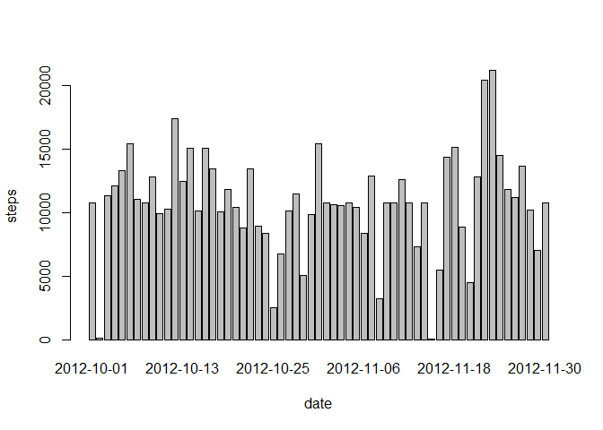

# Reproducible Research: Peer Assessment 1


## Loading and preprocessing the data


```r
activity = read.csv("activity.csv")

data <- na.omit(activity)
```


## What is mean total number of steps taken per day?


```r
stepsByDate <- aggregate(steps ~ date, data = activity, FUN = sum)
barplot(stepsByDate$steps, names.arg = stepsByDate$date, xlab = "date", ylab = "steps")
```

 

```r
mean <- format(mean(stepsByDate$steps), nsmall = 2)
median <- format(median(stepsByDate$steps), nsmall = 2)
```

The mean total number of steps taken per day: <b> 10766.19</b>

The median total number of steps taken per day: <b>10765</b>

## What is the average daily activity pattern?

```r
stepsInterval <- aggregate(steps ~ interval, data = activity, FUN = "mean")
plot(stepsInterval, type = "l")
```

 

```r
max <- stepsInterval$interval[which.max(stepsInterval$steps)]
```

Interval that contains the maximum number of steps: <b>835</b>

## Imputing missing values


```r
nas <- sum(is.na(activity))
```


Total number of missing values: <b>2304</b>

I use the means of the 5-minute intervals as fillers for missing values.


```r
activity <- merge(activity, stepsInterval, by = "interval", suffixes = c("", 
    ".y"))
nas <- is.na(activity$steps)
activity$steps[nas] <- activity$steps.y[nas]
activity <- activity[, c(1:3)]
```


```r
stepsBydate <- aggregate(steps ~ date, data = activity, FUN = sum)
barplot(stepsBydate$steps, names.arg = stepsBydate$date, xlab = "date", ylab = "steps")
```

 

```r
newMean <- format(mean(stepsBydate$steps), nsmall = 2)
newMedian <- format(median(stepsBydate$steps), nsmall = 2)
```

New mean: <b>10766.19 </b>

New median: <b>10766.19 </b>


## Are there differences in activity patterns between weekdays and weekends?


```r
daytype <- function(date) 
{
    if (weekdays(as.Date(date)) %in% c("Saturday", "Sunday")) 
    {
        "weekend"
    }
    else 
    {
        "weekday"
    }
}

activity$daytype <- as.factor(sapply(activity$date, daytype))

par(mfrow = c(2, 1))

for (type in c("weekend", "weekday")) 
{
    steps.type <- aggregate(steps ~ interval, data = activity, subset = activity$daytype == 
        type, FUN = "mean")
    plot(steps.type, type = "l", main = type)
}
```

 

